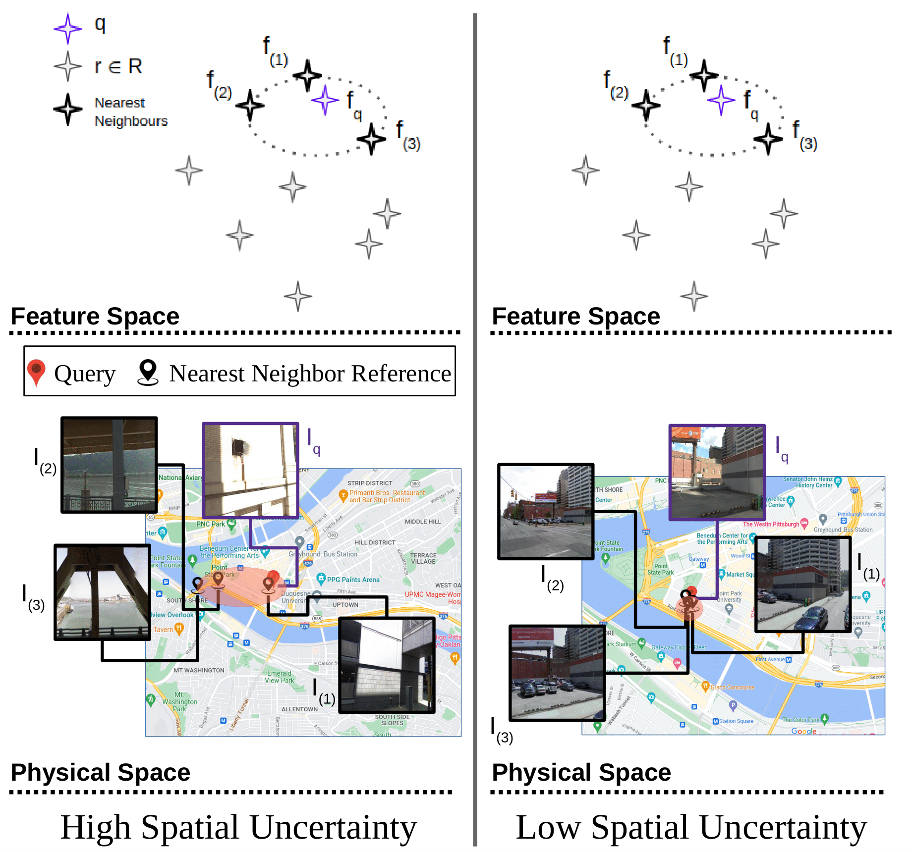

## What is SUE
SUE stands for Spatial Uncertainty Estimation, as published in our CVPR 2024 paper: [On the estimation of image-matching uncertainty in Visual Place Recognition](https://arxiv.org/abs/2404.00546). The purpose of SUE is to estimate whether a retrieval performed for a given query image is correct or not, i.e., to estimate the uncertainty for VPR. The quality of uncertainty estimation is evaluated using Area-under-the-Precision-Recall-Curves (AUC-PR).

```

```

## How to use this code
This codebase is quite simple, which is on purpose. It aligns with our proposal in SUE: something simple surprisingly works quite well, which is presumably why it is a highlight poster at CVPR.

Only the implementation of SUE is provided in `sue.py`. All other baselines are open-sourced in their corresponding repositories, please refer accordingly.

There is an accompanying Conda environment file, please create and activate it with:

    conda env create -f environment.yml
    conda activate sue_env
Run the Python file as:

    python sue.py
It should yield the following terminal output, where these values correpond to the Table 2 of our paper.

    ###########
    AUC-PR_based_on_L2-distance):  0.7970
    AUC-PR_based_on_PA-score:  0.7735
    AUC-PR_based_on_BTL:  0.3419
    AUC-PR_based_on_STUN:  0.6628
    AUC-PR_based_on_SUE:  0.8849
    ###########
    AUC-PR_based_on_SIFT-RANSAC:  0.9313
    AUC-PR_based_on_DELF-RANSAC:  0.9719
    AUC-PR_based_on_SuperPoint-RANSAC:  0.9736
    ###########
## Citation
Please cite our work as:

    @article{zaffar2024estimation,
      title={On the Estimation of Image-matching Uncertainty in Visual Place Recognition},
      author={Zaffar, Mubariz and Nan, Liangliang and Kooij, Julian FP},
      journal={IEEE/CVF Conference on Computer Vision and Pattern Recognition (CVPR)},
      year={2024}
    }

